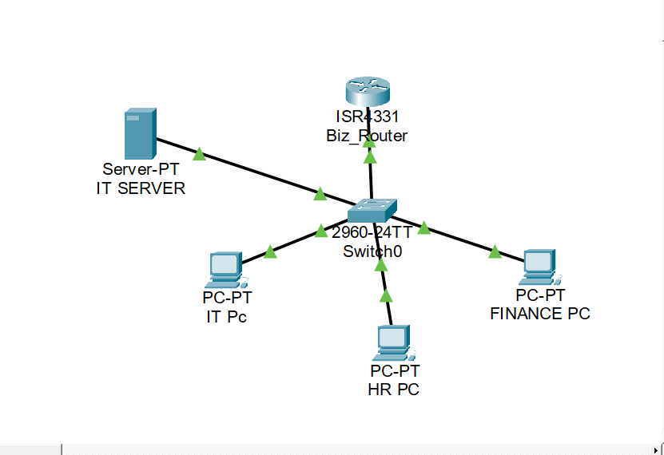
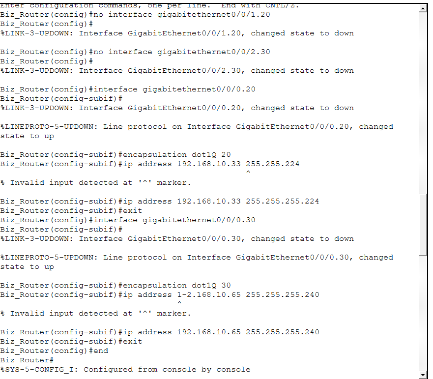
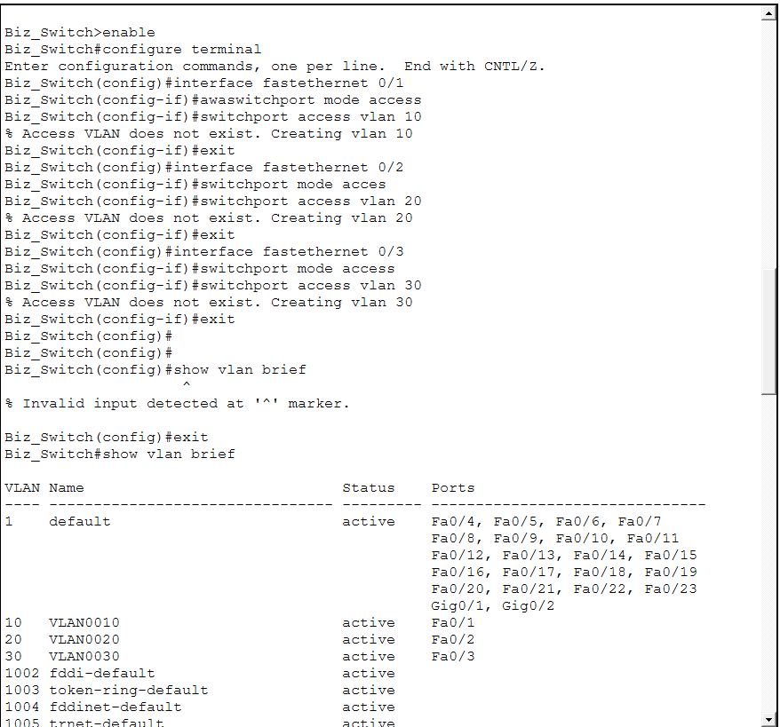
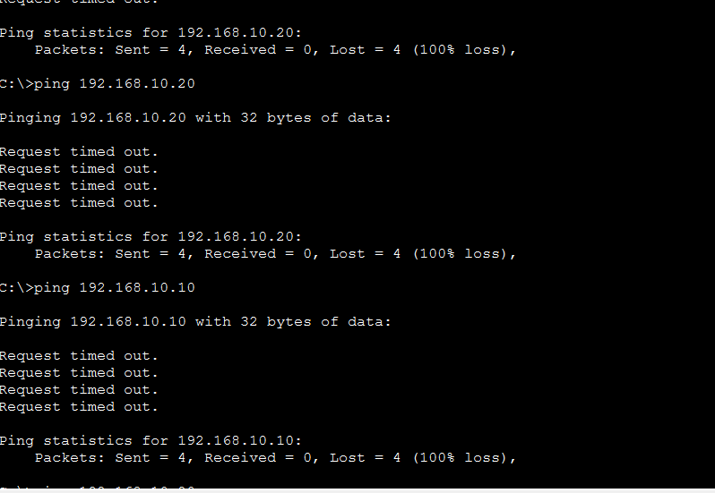
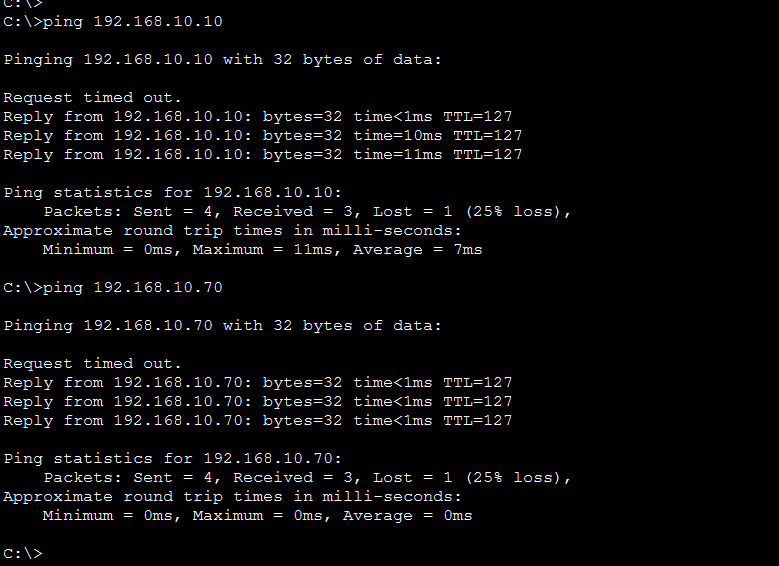
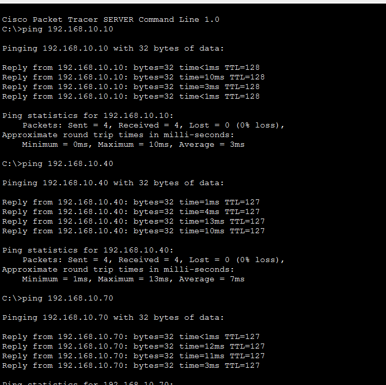

# CCNA Networking Labs

**Cisco CCNA 1: Introduction to Networks**
Hands-on Cisco Packet Tracer Labs & Network Configurations

---

## 📋 About

This repository showcases my practical networking skills through hands-on Cisco Packet Tracer labs completed as part of the Cisco CCNA curriculum.

The labs focus on real-world network design, device configuration, network security, VLAN implementation, inter-VLAN routing, and troubleshooting using Cisco IOS.

**Status:** CCNA 1 – Completed | Continuing with Advanced CCNA Labs

---

## 🎯 Skills Demonstrated

* Router and Switch Configuration
* Cisco IOS Command Line Interface (CLI)
* Device Security Configuration
* SSH Remote Management
* IPv4 Addressing & Subnetting
* VLSM (Variable Length Subnet Masking)
* VLAN Configuration
* Inter-VLAN Routing (Router-on-a-Stick)
* Connectivity Verification & Troubleshooting
* Network Documentation

---

# 🛠️ Lab 1: Basic Router & Switch Configuration

## Objectives

* Configure device hostnames
* Configure secure passwords and login banners
* Configure console and VTY access
* Implement SSH for secure remote management
* Configure router and switch interfaces
* Verify network connectivity

## 📁 Files

* **[Packet Tracer File](Lab%201-Basic-Configuration/BASIC%20DEVICE%20CONFIGURATION%20AND%20SECURITY.pkt)**
* **[Network Topology](Lab%201-Basic-Configuration/topology.png)**
* **[Ping Test Results](Lab%201-Basic-Configuration/Pingtest.png)**

## 📸 Screenshots

### Network Topology

### Connectivity Verification

---

# 🛠️ Lab 2: VLSM & Inter-VLAN Routing (Router-on-a-Stick)

## Objectives

* Design a network using Variable Length Subnet Masking (VLSM)
* Configure VLANs for network segmentation
* Configure trunk links between switches and routers
* Implement Router-on-a-Stick inter-VLAN routing
* Configure router subinterfaces
* Verify communication between VLANs
* Troubleshoot connectivity issues using ping tests

## Technologies Used

* Cisco Packet Tracer
* Cisco IOS
* VLANs
* 802.1Q Trunking
* Router-on-a-Stick
* VLSM Addressing

## 📁 Files

* **[Packet Tracer File](Lab2-VLSM-ROUTER-ON-STICK/Lab2-VLSM-and-Inter-Vlan-Routing.pkt)**
* **[Network Topology](Lab2-VLSM-ROUTER-ON-STICK/Topology.png)**
* **[Router Configuration](Lab2-VLSM-ROUTER-ON-STICK/RouterCofig.png)**
* **[Switch Configuration](Lab2-VLSM-ROUTER-ON-STICK/Switch_Config.png)**

## 📸 Screenshots

### Network Topology

### Router Configuration

### Switch Configuration

### Initial Connectivity Test

### Successful Inter-VLAN Communication

### IT Server Connectivity Verification

---

## 🚀 Upcoming Labs

* VLAN Security & Port Security
* Static Routing
* Dynamic Routing (RIP, OSPF)
* DHCP Configuration
* Access Control Lists (ACLs)
* Network Address Translation (NAT)
* WAN Technologies
* Network Automation Fundamentals

---

## 📈 Learning Progress

| Lab   | Topic                               | Status     |
| ----- | ----------------------------------- | ---------- |
| Lab 1 | Basic Router & Switch Configuration | ✅ Complete |
| Lab 2 | VLSM & Inter-VLAN Routing           | ✅ Complete |
| Lab 3 | VLAN Security & Port Security       | 🔄 Planned |
| Lab 4 | Static Routing                      | 🔄 Planned |
| Lab 5 | DHCP Configuration                  | 🔄 Planned |

---

## 🔗 Connect With Me

**Email:** [obatomaleen16@gmail.com](mailto:obatomaleen16@gmail.com)

I am open to opportunities in:

* Networking
* IT Support
* NOC Operations
* Graduate Trainee Programs
* Junior Network Administration
* Infrastructure Support

---

## 📜 Disclaimer

This repository is intended for educational, learning, and portfolio purposes. All labs were built and configured using Cisco Packet Tracer to develop practical networking skills aligned with the CCNA curriculum.
